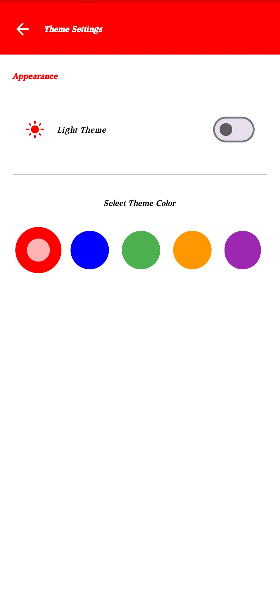
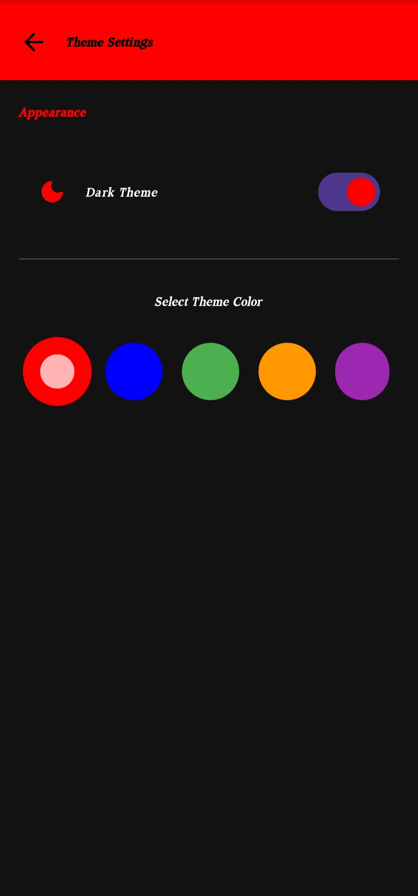

# Comeback App

An entertaining Android application that humorously claims to check if your device is compatible with the app (spoiler: it isn't).

## Overview

Comeback is a fun app built with Jetpack Compose that generates humorous "rejection messages" when users attempt to install it. The app integrates with Google's Gemini AI to create personalized, witty messages that give users a good laugh.

## Features

- 🚀 **Fake Compatibility Check**: Pretends to check if your device is compatible with the app
- 🤣 **AI-Generated Humor**: Uses Gemini API to generate funny rejection messages
- 💬 **Smart Chat Mode**: Engage in witty conversations with AI-generated comebacks in multiple styles
- 🌐 **Multilingual Support**: Available in English, Spanish, French, and Hindi
- 🎨 **Theme Customization**: Choose from various color themes and toggle dark mode
- 👤 **Personalized Messages**: Create custom rejection messages including your name
- 🥚 **Easter Eggs**: Hidden mini-games activated by special interactions
- 🧭 **Onboarding Experience**: Smooth introduction for first-time users

## Screenshots

### Smart Chat Interface


### Different Roast Types


### Message Interaction




## Technical Details

### Architecture
The app follows MVVM (Model-View-ViewModel) architecture with a clean separation of concerns:

- **Data Layer**: API services and preferences management
- **UI Layer**: Compose UI components, screens, and themes
- **ViewModel Layer**: Business logic and state management

### Tech Stack
- **UI**: Jetpack Compose with Material 3 design system
- **Navigation**: Compose Navigation
- **State Management**: Flow, StateFlow with Compose State
- **Networking**: Retrofit, OkHttp for API communication
- **AI Integration**: Google Gemini API for content generation and Smart Chat responses
- **Text Formatting**: Compose Markdown for rich text display
- **Local Storage**: DataStore for user preferences
- **Animations**: Compose animations and transitions

## Smart Chat Mode

The new Smart Chat Mode feature allows users to:
- Exchange messages with an AI assistant that provides witty comebacks
- Choose between three "roast" intensities: Mild, Sarcastic, and Savage
- Share AI-generated responses with friends
- View stylized responses with markdown formatting
- Delete or clear message history

See the [Smart Chat Mode documentation](./docs/SmartChatMode.md) for more technical details.

## Easter Eggs

The app includes hidden mini-games that can be triggered by tapping the app logo three times on the home screen:

1. **Color Match Game**: Match the displayed color in a timed challenge
2. **Memory Game**: Find matching pairs of fruit emoji cards
3. **Spin Logo Game**: Tap the spinning logo as many times as possible before time runs out

## Setup Instructions

### Prerequisites
- Android Studio Flamingo (2023.2.1) or higher
- Minimum SDK: 24 (Android 7.0)
- Target SDK: 35
- Kotlin 1.9.0 or higher

### Configuration

1. Clone the repository
   ```
   git clone https://github.com/abhishek-maurya576/comeback.git
   cd comeback
   ```

2. Set up the Gemini API key
   - Get your API key from the [Google AI Studio](https://makersuite.google.com/app/apikey)
   - Create or edit the `local.properties` file in the project root
   - Add your API key: `gemini.api.key=YOUR_API_KEY_HERE`
   - Alternatively, copy the `local.properties.example` file and rename it to `local.properties`, then add your API key

3. Build and run the app
   ```
   ./gradlew build
   ```
   
4. Run the app on your device or emulator from Android Studio

### Security Notes

- The `local.properties` file is automatically excluded from Git in the `.gitignore` file
- Never commit your API keys or secrets to version control
- For production releases, consider using a more secure approach like a backend proxy

### Dependencies
See the `app/build.gradle.kts` file for a complete list of dependencies.

## Documentation

- [User Guide](./docs/UserGuide.md) - How to use the app features
- [Smart Chat Mode](./docs/SmartChatMode.md) - Technical details of the Smart Chat feature
- [Changelog](./CHANGELOG.md) - Version history and release notes

## License

[License details to be added]

## Contributors

[Contributors to be added] 